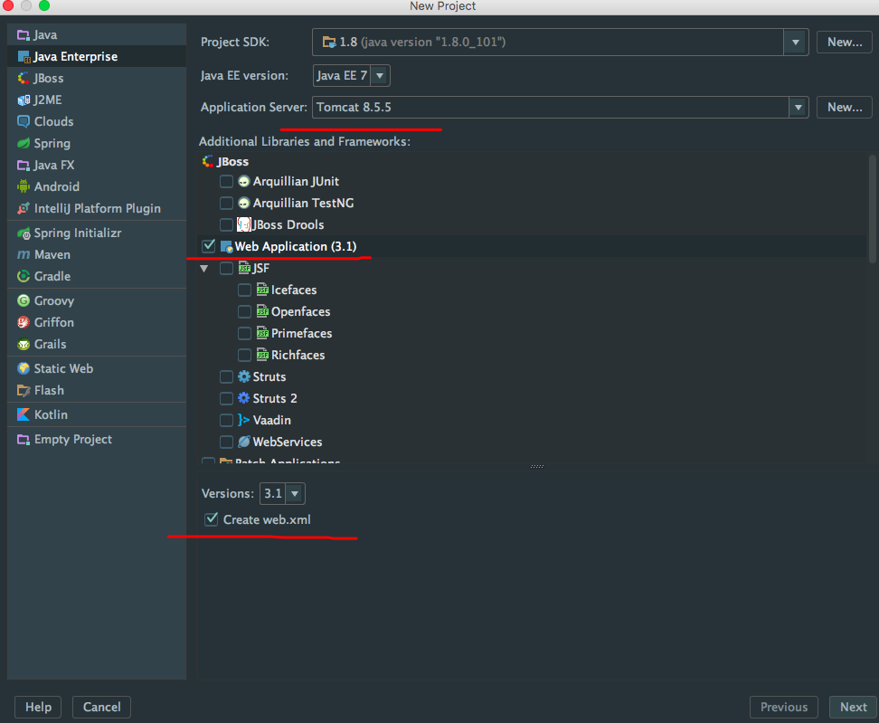
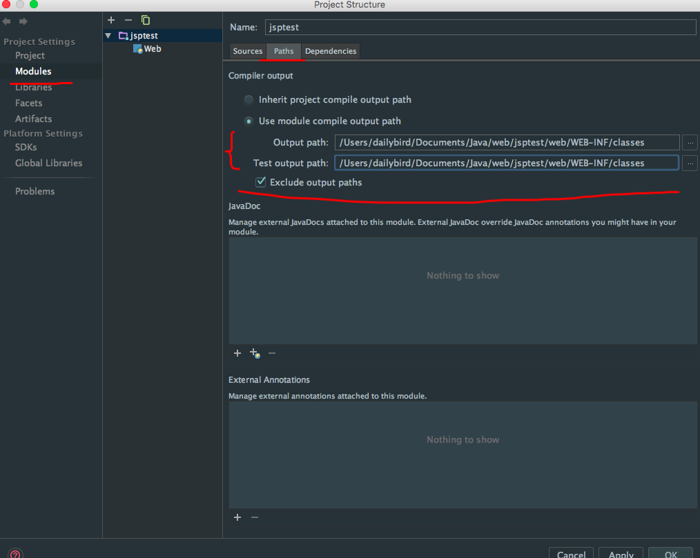
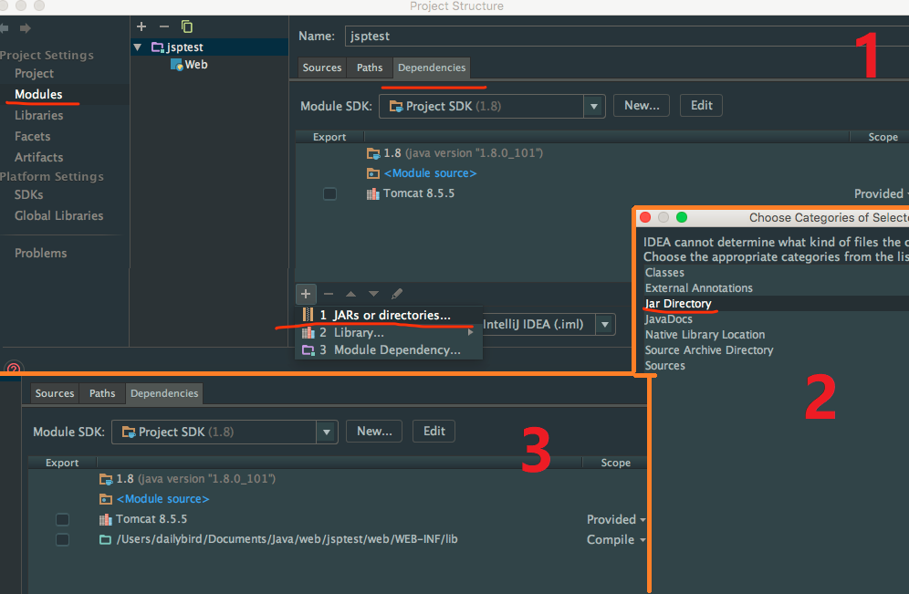
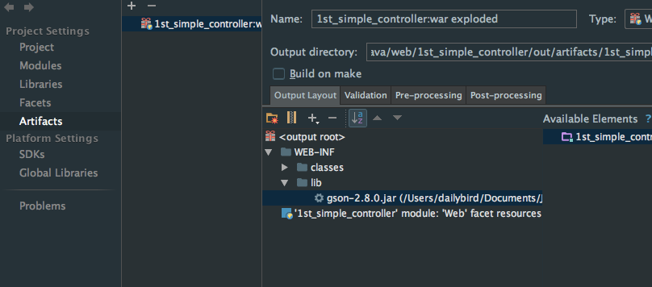
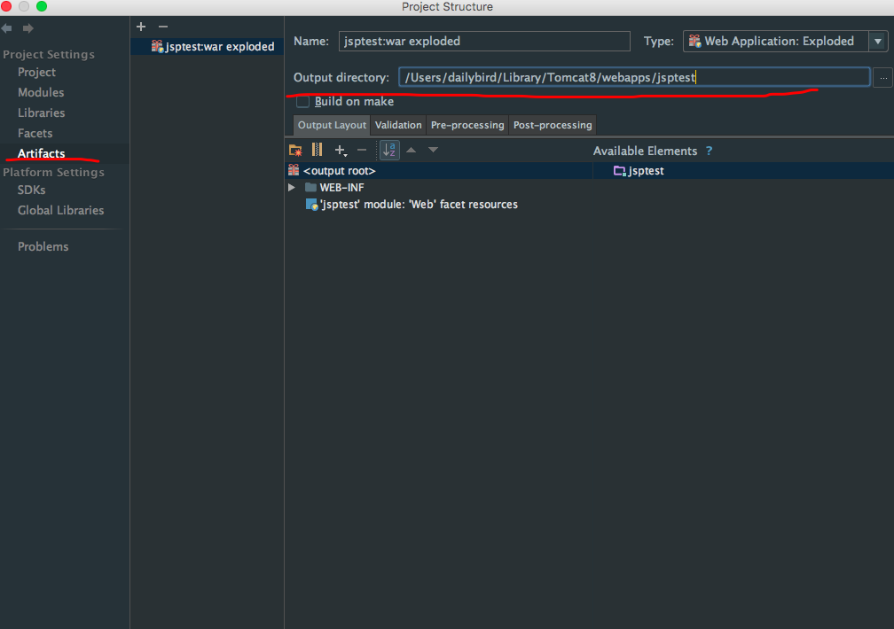
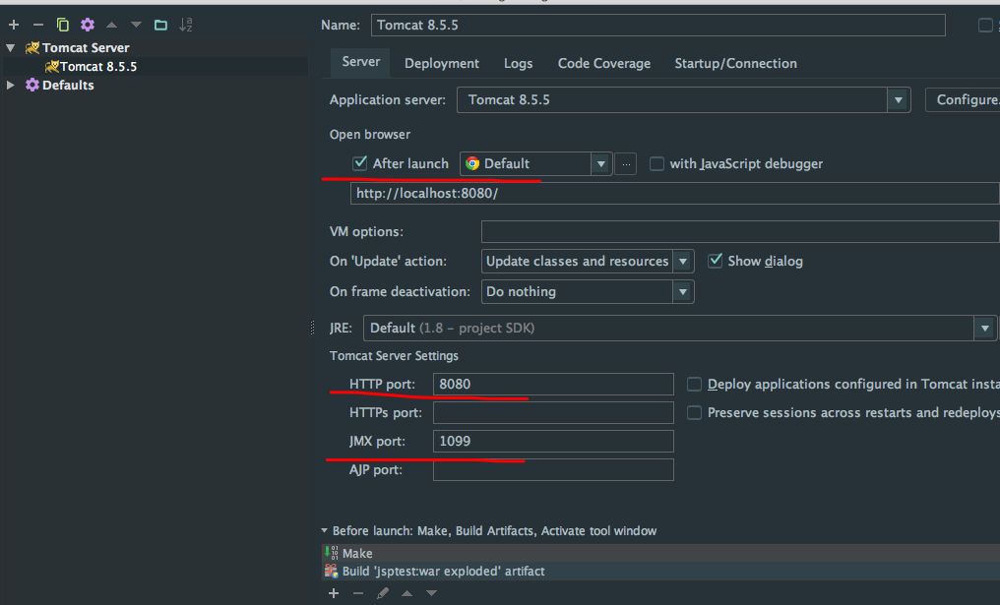
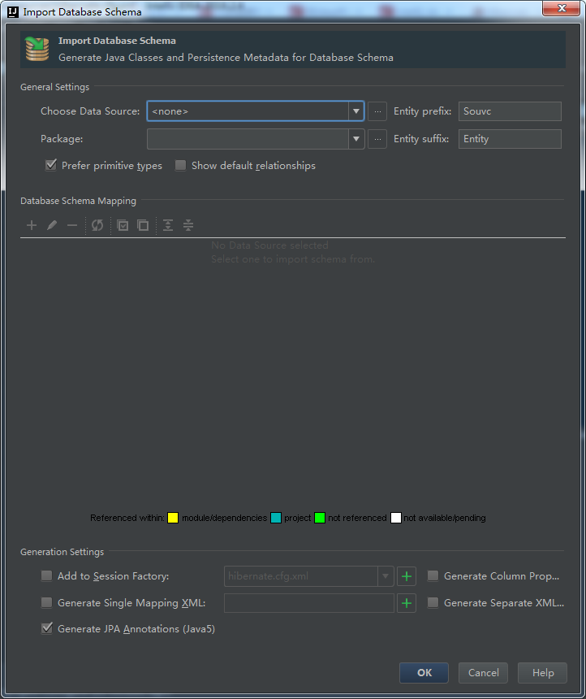

# IDEA使用

快捷键、基本配置等就不说了，主要说开发 java web 时候的使用

总之，信 JB 就对了，软件做的棒！

## 新建一个web工程

>   感觉这篇已经写的很全了，我就文字说下简单的步骤
>
>   https://segmentfault.com/a/1190000007088964

主要步骤为：

1.  **新建工程**，选择 `Java Enterprise` 如有需要可以选择一些框架，比如 SSH 

    

2.  **配置输出目录和库目录**（IDEA 默认的输出目录很....不喜欢）

    在 `WEB-INF` 目录下新建 classes 目录和 lib 目录

    在项目设置的 Modules 中的 Path 为 classes 目录(编译后的输出目录)：

    

    在项目设置的 Modules 中的 Dependencies 中添加库，目录为新建的 lib，类型是 jar Dir （这样 lib 下的库会在编译的时候输出）:

    

    在 `Artifacts > Output Layout` 中，将右侧 `Available Elements` 中的 `lib` 文件夹加入到左侧，使得 `lib` 中的文件会在编译的时候输出：

    

3.  **设置部署目录**
    IntelliJ 默认的部署目录是当前工程目录下的 `out` 文件夹。即在写好代码并点击右上角的运行按钮后，IntelliJ 会将项目文件输出到当前项目目录下的 `out` 文件夹而不是 `webapps` 中，也就意味着，此时如果采用手动启动 Tomcat 服务的方式，是无法通过访问 `localhost:8080/myproject` 访问项目的

    这里修改 `Artifacts > Output Directory` 为 `webapps/myproject`：

    

4.  **配置web服务器**
    在运行的左边，点击 `Edit Configurations...` 取消 After launch ，我是不喜欢，勾上后点运行会自动打开浏览器

    

    下面的网址中在后面加上本项目的名字，这个都知道哈，在 Deployment 中的右栏也写一下
    其他配置像 Tomcat 的路径啊就不说了，简单

    

PS：如果使用了框架，比如 struts2 ，在 Artifacts 中的 Output Layout 里点击 struts2 鼠标右键 `put into lib`

## web项目的运行原理

可以注意到，IDEA 中运行 Tomcat 进行调试的时候，在 webapps 目录下是不存在相关文件的，于是我就好奇了，驱使我要搞明白

>   原文：http://www.voidcn.com/blog/yangcheng33/article/p-6265449.html

这个需要先从 `CATALINA_HOME` 和 `CATALINA_BASE` 这两个“环境变量”的区别入手。

简单的说，`CATALINA_HOME` 是 Tomcat 的安装目录，`CATALINA_BASE` 是 Tomcat 的工作目录。

当我们想要运行多个 Tomcat 实例，但是不想拷贝多个 Tomcat 副本时，那么我们可以配置多个不同工作目录，在运行 tomcat 时对每个实例指派不同的工作目录，它们共享安装目录的运行文件（bin目录下）。

这么看来 `CATALINA_BASE` 所指向的就是 conf、logs、temp、webapps、work 和 shared 目录。
而 `CATALINA_HOME` 则包括了 Tomcat 的二进制文件和脚本目录，也就是 bin 和 lib 目录。

---

**下面就是正文了**

首先 Intellij 会为每个 web 项目建立一个单独的文件夹，以 `“Unnamed_项目名”` 命名（可在 **.idea/workspace.xml** 中修改）。

在每次启动项目时，它先将 tomcat 目录下原始的 `CATALINA_BASE` 目录拷贝一份**到该目录下**，也就是将当前 tomcat 的**配置文件**拷贝到 `“Unnamed_项目名”` 文件夹下。

然后将 `CATALINA_BASE` 的路径修改为该目录的路径，**再在 `Unnamed_项目名/conf/Catalina/localhost` 下添加项目的配置文件，如 code.xml**，内容为

```xml
<?xml version="1.0" encoding="UTF-8"?>
<Context path="/code" docBase="/Users/didi/project/CODE-PROJ/didi-code-web/target/code" />
```

最后启动 tomcat，tomcat 除了会启动 webapps 下应用外还会加载 `/conf/Catalina/localhost` 下配置的应用，而 Intellij 就是通过这种方式**“隐蔽”**地加载 web 项目。

看到这儿你可能还会发现为什么在 tomcat 安装目录下始终找不到项目 log 文件的原因了，因为 `CATALINA_BASE` 指向了 `/Users/xxxx/Library/Caches/IntelliJIdea2016.1/tomcat/Unnamed_didi-code`，所以指定相对路径 `${catalina.base}` 的 log 文件就存在了该目录下。

>   `startup.sh` 设置环境变量时调用 `catalina.sh` 脚本，此脚本会读取 **CATALINA_BASE** 的值，在 **$CATALINA_BASE/conf** 目录，得到 **server.xml**。
>
>   这个文件是 Tomcat 的核心配置，它包含所有的配置信息，如 shutdown 端口，connector 端口，主机名称，应用目录等。例如，Tomcat通常使用 8080 作为连接端口，所以我们可以通过 http://localhost:8080/ 访问。
>
>   如果我们已经设置 **$CATALINA_BASE**，Tomcat 就会从该变量所对应的目录搜索得到 **server.xml**。

## 逆向生成数据库实体

1.  连接数据库
    从右边的侧边栏进也行，从菜单的 view 里进也行，总之能找到 database 并添加相应的数据库就行；这里就没什么好说的了

2.  **生成实体**
    生成实体使用的是 IDEA 的 persistence 工具，可以从左下角的侧边栏找到或者从 view 中找到

    如果是灰色的或者其他什么问题可以尝试在 **项目设置**中的 Module 中添加 JPA 模块，然后就是选择：**Generate Persistence Mapping ---> By Database Scheme**

    

需要注意的是，如果不配置 hibernate 的配置文件（或者 JPA 配置文件）也有可能是不会显示 persistence  工具的，或者生成的时候没法选择 `add to Session Factory` ；这个的意思就是将生成的实体添加 hibernate 的配置文件中

## 关于编码

今天创建 properties 文件用于国际化，发现中文获取出来的都是乱码，仔细一看右下角的编码是 GBK，最可气的是 TMD 是灰色的！不能改！

这个故事告诉我们一定记得在设置里 File Encodings 中的最下面设置编码！要么设置 U8 要么勾选后面的转换编码选项！

## 自动生成serialVersionUID

这个具体的作用应该是用于**反序列化**的，具体应该用在什么地方我还不太清楚.....额

打开开关为：Setting->Inspections->Serialization issues->Serializable class without ’serialVersionUID’ 

选上以后，在你的 class 中：Alt+Enter 就会提示自动创建 serialVersionUID 了。

其实可以直接搜 serialVersionUID 就行了....

## 重构相关

提取代码功能应该是很常用的，比如抽取方法、属性到新类啊，抽取出一个接口啊

这个在 Refactor->Extract 下，比如：

-   Delegate：抽取方法、属性到新的类
-   Interface：选中某些方法抽取成接口
-   Superclass：选中某些方法抽取成基类

## 查看类关系

基本的可以使用 Ctrl + H 来查看继承关系，如果想要更直观的使用图标描述，IDEA 支持！

选择类或者在代码中的类名上鼠标右键 **Diagrams** 一个是独立的视图一个是浮动视图，非常直观

如果字太小看不清可以按住 Alt 键使用放大镜，真赞！

## 测试相关JUnit

IDEA 自带一个 JUnit 插件，打开 Settings 窗口搜索 junit 可以看到插件页面，但是呢，该插件使其可以运行 JUnit 测试文件，但无法自动生成 JUnit 测试代码，如果需要自动生成测试代码，需要安装 **JUnitGenerator V2.0** 这个插件

安装后，在需要测试的类文件里点击 `code->Generate` 就可以看到相关菜单了，我是习惯直接使用快捷键 Alt+Insert；或者你还可以直接在类上 Alt+Enter 就会出现相关的菜单

选择 JUnit 4 生成的测试文件 @since 位置 Date 可能存在乱码，可配置 JUnit 模板更改日期格式，至于原因我也不知道，修改也很简单

```java
/** 
* ${entry.className} Tester. 
* 
* @author <Authors name> 
* @since <pre>$today</pre> 
* @version 1.0 
*/ 
```

就是修改 `* @since <pre>$today</pre> ` 这一行，把本来的 Date 改成 today 就可以了

当然你还可以修改测试代码生成的位置默认是：`${SOURCEPATH}/test/${PACKAGE}/${FILENAME}` 可以改为`${SOURCEPATH}/../test/${PACKAGE}/${FILENAME}`

>   **${SOURCEPATH}** ： 是到 src 这一层（可以通过下面的方法进行指定）
>   **../** ：是退到上一层目录的意思

PS：把一个目录设置位测试目录或者源文件目录只需要在目录上右键然后选择 **MarkDirectoryAs** 然后选择相应的选项即可

## 其他

正常情况下，从 IDEA 启动 Tomcat 是不能访问以前 webapps 里的应用的，如果需要，在服务器配置页面记得勾选 `Deploy applications configured in tomcat instance`

或者可以在服务器的配置选择 deployment 然后进行手动添加要加载的 web 应用

待补充...