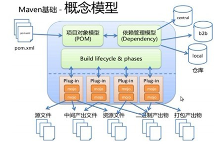

## Maven简介

Maven 是一个强大的 **Java 项目构建工具。** 对于其他语言也是可以的，但是主要是 Java，是 Apache 开发的。
主要作用就是：**项目的构建和依赖管理**

项目构建体现在：在项目编码完成后，要对项目进行编译、测试、打包、部署；这些工作 Maven 都可以做到

依赖管理它的好处体现于：
不需要再导入 jar 包，大大降低了项目文件的占用大小（它会根据配置的“坐标”去 Maven 仓库里去寻找对应的 jar 包）

## 安装

Maven 是用 Java 开发的，所以它的运行需要 JDK 支持，和 Java（JAVA_HOME） 类似，只需要把解压后的目录放进环境变量就行了，名称可以叫 **MAVEN_HOME**，然后再配进 path 里
然后在 CMD 命令行中输入 `mvn -v` 测试下是否正常

## 配置本地仓库

Maven 仓库存的是各种各样的 jar 包，可以在本地搭建也可以在局域网中搭建，或者直接用互联网上的中央仓库

配置本地仓库去修改 Maven 目录下的 conf 目录下的 `settings.xml` 文件，将 localRepository 标签配好即可

## Maven项目目录结构

和一般的项目也没啥区别，都有 src 源码文件夹，只是多了一个 `pom.xml` 文件，这个是 Maven 项目的核心配置文件，里面可以配置 JDK 的版本、jar 包的相关信息

另外，Maven 下的 src 文件夹是有一定结构的，里面分为两个文件夹，main 和 test，从名字可以看出一个是主要，一个是测试；main 里面继续分，分为 java、resources(项目所需的配置文件) 和 webapp 文件夹；没有 lib 了，因为没有 jar 包什么事了

|-ProjectName
|-- pom.xml
|-- src
|--|-- main
|--|--|-- java
|--|--|-- resources
|--|--|-- [ webapp/WEB-INF/web.xml ]
|
|--|-- test
|--|--|-- java
|--|--|-- resources

## Maven常用命令

-   `mvn clean` 清理编译后的文件，也就是 targen 目录
-   `mvn compile` 编译；编译后的文件在 targen 目录下
-   `mvn test` 进行测试；运行测试目录下类的所有测试方法
    注意类名的规范：`xxxTest.java`
-   `mvn package` 打包；默认会先编译再进行测试，最后执行打包，如果是 web 项目会自动打成一个 war 包，放在 targen 目录下
-   `mvn install` 安装；把 jar 包安装到本地仓库中去，便于其他项目使用
    过程还是先编译再测试，然后打包，最后再安装。也可以说是打包到本地仓库
-   `mvn tomcat:run` 部署到 Tomcat （通过 war 包），并且启动

## Maven项目生命周期

在 Maven 中存在三套生命周期，它们相互独立，互不影响（不同周期里的命令不会互相调用），**在一套生命周期中，执行后面的命令，前面的命令会自动执行**

-   CleanLifeCycle：清理生命周期
    包含命令：clean
-   DefaultLifeCycle：默认生命周期
    包含命令：compile --> test --> package -->install -->deploy
-   siteLifeCycle：站点生命周期
    包含命令：site

## 依赖范围

依赖范围可分为：编译依赖范围、测试依赖范围、已提供依赖范围、运行依赖范围、系统依赖范围、导入依赖范围

|   依赖范围   | 对于编译有效 | 对于测试有效 | 对于运行有效 |     栗子      |
| :------: | :----: | :----: | :----: | :---------: |
| compile  |   √    |   √    |   √    | spring-core |
|   test   |   -    |   √    |   -    |    junit    |
| provided |   √    |   √    |   -    | servlet-api |
| runtime  |   -    |   √    |   √    |   JDBC 驱动   |
|  system  |   -    |   -    |   √    |      -      |
|  import  |   -    |   -    |   -    |      -      |

系统依赖范围通过 systemPath 显式指定；再说导入依赖范围，它不会对 classpath 产生影响。

依赖范围除了控制 classpath，还会对依赖传递产生影响。如果 A 依赖 B，B 依赖 C，则 A 对于 B 是第一直接依赖。B 对于 C 是第二直接依赖。 A 对于 C 是传递性依赖。**结论是：第一直接依赖的范围和第二直接依赖的范围决定了传递性依赖的范围。**

| 第一依赖\第二依赖 | compile  | test | provided | runtime  |
| :-------: | :------: | :--: | :------: | :------: |
|  compile  | compile  |  -   |    -     | runtime  |
|   test    |   test   |  -   |    -     |   test   |
| provided  | provided |  -   | provided | provided |
|  runtime  | runtime  |  -   |    -     | runtime  |

第一列是第一直接依赖，第一行是第二直接依赖，中间表示传递性依赖范围。

## 概念模型

用一幅图片来表示就是：

上面的部分是处理依赖关系，下面的就是项目构建了...

## 参考

[木杉](http://mushanshitiancai.github.io/2016/07/29/java/%E8%AF%B4%E8%AF%B4maven%E4%BE%9D%E8%B5%96%E5%86%B2%E7%AA%81-%E4%BE%9D%E8%B5%96%E8%B0%83%E8%A7%A3-%E4%BE%9D%E8%B5%96%E4%BC%A0%E9%80%92%E5%92%8C%E4%BE%9D%E8%B5%96%E8%8C%83%E5%9B%B4/)