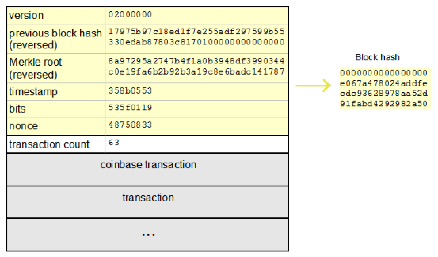

# 关于区块链

说到区块链就不得不提比特币，首先来简单介绍下比特币吧，官网上是这样说的：

> 比特币基于P2P技术运作，无需中央管理机构或银行；交易管理和比特币发行由比特币网络统一进行。比特币是开源的；其设计是公开的，任何人都无法拥有或控制比特币网络，人人都可参与其中。基于其种种独有的特性，比特币使之前任何支付系统都无法实现的激动人心的用途成为可能。

比特币的优势：

- 通过互联网可以直接在人与人之间传送，而不需要通过银行等机构，这也就意味着交易费用非常低
- 可以在任何国家使用（理论上）
- 没有人可以冻结你的资金，不存在任何的扣费
- 创建账户不需要具备任何条件，不受到任何约束

~~当然了，首先你要有一个比特币钱包才行~~，比特币目前被视为高风险资产（价格多变），简单玩玩就好。

下面正式开始！

## 背景

在数字货币的探索实践中，比特币是目前表现最好的一个。说到比特币的缘起，就不得不谈到一个略显神秘的团体：**密码朋克（CypherPunk）。**

这个团体是密码天才们的松散联盟。在比特币的创新中，大量借鉴了密码朋克成员的贡献。

密码朋克本身就是数字货币最早的传播者，在其电子邮件组中，常见关于数字货币的讨论，并有一些想法付诸实践。在比特币之前，有很多失败的尝试。

### 比特币的诞生

2008年9月，以雷曼兄弟的倒闭为开端，金融危机在美国爆发并向全世界蔓延。为应对危机，各国政府采取量化宽松等措施，救助由于自身过失、陷入危机的大型金融机构。这些措施带来了广泛的质疑，并一度引发了“占领华尔街”运动。

2008年10月31日纽约时间下午2点10分，在一个普通的密码学邮件列表中，几百个成员均收到了自称是中本聪的人的电子邮件，“我一直在研究一个新的电子现金系统，这完全是点对点的，无需任何可信的第三方”，然后他将他们引向一个九页的白皮书，其中描述了一个新的货币体系。同年11月16日，中本聪放出了比特币代码的先行版本。

2009年1月3日，中本聪在位于芬兰赫尔辛基的一个小型服务器上挖出了比特币的第一个区块——创世区块（Genesis Block），并获得了首矿奖励——50个比特币。

如今，比特币已经成为数字货币领域的翘楚，拥有数十亿美元的市值，但中本聪却于2010年选择隐退。中本聪是谁，对每一个开始了解比特币的人，都是感兴趣的话题。从《纽约客》到《新闻周刊》，媒体们找到了数个自称是中本聪，或者被认为是中本聪的人。但无一例外，这些发现都因为可信度不足，遭到了读者甚至是中本聪本人的否定。中本聪是谁？也许我们永远不得而知

## 比特币与区块链

比特币已经在争议中走过了7年多的历程。在历史上，很少有这样一种东西，人们对待它的态度如此泾渭分明，支持者认为它将改变世界，反对者认为它毫无价值。望文生义，很容易得出后一个结论。

其实，在比特币的系统中，最重要的并不是“币”的概念，而是一个没有中心存储机构的“账本”的概念。“币”只是在这个账本上使用的记账单位。

可以这么说，比特币本质就是一个基于互联网的去中心化账本，而区块链就是这个账本的名字。这里我们可以做一个形象的类比，假如区块链是一个实物账本，一个区块就相当于账本中的一页，区块中承载的信息，就是这一页上记载的交易内容。

**区块链是比特币的核心与基础架构，是一个去中心化的账本系统。**

在以前，乃至目前的大部分公司机构记账都是中心化的，中心化的记账却有一些显而易见的弱点：一旦这个中心出现问题，如被篡改、被损坏，整个系统就会面临危机乃至崩溃。

**我们能不能构建一个去中心化的不依赖任何第三方的但却可信的记账系统呢？**

在数字时代，负责记账的自然是计算机。这里，我们把记账系统中接入的每一台计算机称为“节点”。去中心化就是没有中心，也就是说参与到这个系统中的每个节点都是中心。从设计账本系统的角度，就是需要每个节点都保存一份完整的账本。然而，由于一致性的要求，**每个节点却不能同时记账**。因为节点所处的环境不同，接收到的信息自然不同，如果同时记账的话，必然会导致账本的不一致，造成混乱。

既然节点不能同时记账，那我们就不得不选择哪个节点拥有记账的权力。但是，如果指定某些特殊节点拥有记账的权力，势必又会与我们去中心化的初衷相违背。

这似乎成了不可能解决的问题。

## 竞争记账和激励机制

中本聪设计的比特币区块链通过竞争记账的方式解决了去中心化的记账系统的**一致性问题（同时记账问题）**。

前面提到，节点可以理解为接入系统中的计算机，而所谓的竞争记账，就是以每个节点的计算能力即“算力”来竞争记账权的一种机制。在比特币系统中，大约每十分钟进行一轮算力竞赛（算力大小会决定赢得一轮竞争的概率，算力高的节点赢得算力竞争的概率更大），竞赛的胜利者，就获得一次记账的权力，这样，一定时间内，只有竞争的胜利者才能记账并向其他节点同步新增账本信息。

那么，在一个去中心化的系统中，谁有权判定竞争的结果呢？比特币系统是通过一个称为“工作量证明”（proof of work, POW）的机制完成的。举个简单的例子，比如说要生产一些玩具，早上起来我给你一些零件，晚上回来，看到需要的玩具摆在桌上，虽然我没有从早到晚盯着你做玩具的过程，我也能确定你确实做了这么多工作。这就是工作量证明简单的理解——通过一个（**人人都可以验证的**）特定的结果就能确认（竞争的）参与者完成了相应的工作量。

算力竞争是要付出成本的，没有激励，节点就没有进行竞争的动力。在中本聪的设计里，每轮竞争胜出并完成记账的节点，将可以获得系统给予的一定数量的比特币奖励。**而这个奖励的过程，同时也是比特币的发行过程**。这种设计相当巧妙 —— 它将竞争的激励机制与货币的发行完美结合到一起，**在引入竞争的同时，解决了去中心化货币系统中发行的难题**。

在这个系统中，每一个节点只需要根据自身利益行事。出于“自私”的目的进行的竞争，最终造就了保护系统安全的庞大算力基础。在这样精巧的安排下，比特币获得了越来越多的信任，和越来越高的价值，进而又吸引了更多的资源投入其中，成为一个正向循环的经济系统。

正因为比特币通过区块链的机制造就了这样一个正向循环的经济系统，才会在没有强大的中心化机构推动的情况下，自然的生长出来并发展壮大。

读到这里，显然我们会发现，虽然区块链脱胎于比特币，但区块链无论作为一个系统还是作为一项技术，它的应用领域及发展潜力，将远不止货币。

> 记账奖励包括一个数量的比特币和该区块包含的所有交易的手续费。系统发放的记账奖励每四年进行一次减半。最开始为50币/区块，目前为25币/区块，以此类推，直到系统中的总币数**达到2100万的上限**。

**麦肯锡的一份报告甚至把区块链定位为“继蒸汽机、电力、信息和互联网技术之后，目前最有潜力触发第五轮颠覆式革命浪潮的核心技术”**

## 深入了解工作量证明(POW)

工作量证明，字面理解就是用来确认你做过一定量的工作。**监测**工作的整个过程通常是**极为低效**的，而通过对工作的**结果进行认证**来证明完成了相应的工作量，则是一种**非常高效**的方式。比如现实生活中的毕业证、驾驶证等等，也是通过检验结果的方式（通过相关的考试）所取得的证明。

工作量证明系统（或者说协议、函数），是一种应对拒绝服务攻击和其他服务滥用的经济对策。它要求发起者进行一定量的运算，也就意味着需要消耗计算机一定的时间。这个概念由Cynthia Dwork 和Moni Naor 1993年在学术论文中首次提出。而工作量证明（POW）这个名词，则是在1999年 Markus Jakobsson 和Ari Juels的文章中才被真正提出。

**哈希现金**是一种工作量证明机制，它是亚当·贝克（Adam Back）在1997年发明的，用于抵抗邮件的拒绝服务攻击及垃圾邮件网关滥用。在比特币之前，哈希现金被用于垃圾邮件的过滤，也被微软用于hotmail/exchange/outlook等产品中（微软使用一种与哈希现金不兼容的格式并将之命名为电子邮戳）。

哈希现金也被哈尔·芬尼以可重复使用的工作量证明（RPOW）的形式用于一种比特币之前的加密货币实验中。另外，戴伟的B-money、尼克·萨博的比特金（Bit-Gold）这些比特币的先行者，都是在哈希现金的框架下进行挖矿的。

> 关于哈希现金，有机会再展开说说，这里提一下，知道它是一种工作量证明机制就可以了

### 哈希函数

哈希函数（Hash Function），也称为**散列函数**，给定一个输入 x，它会算出相应的输出 H(x)。哈希函数的主要特征是：

1. 输入 x 可以是任意长度的字符串
2. 输出结果即 H(x) 的**长度是固定的**
3. 计算 H(x) 的过程是高效的（对于长度为 n 的字符串 x，计算出 H(x) 的时间复杂度应为 O(n)）

而对于比特币这种“加密”系统所使用的哈希函数，它需要另外具备以下的性质：

1. 免碰撞，即不会出现输入 x≠y，但是 H(x)=H(y) 的情况

   **其实这个特点在理论上并不成立**，比如，比特币使用的 SHA256 算法，会有 2^256 种输出，如果我们进行 2^256 + 1 次输入，那么必然会产生一次碰撞；

   甚至从概率的角度看，进行 2^130 次输入就会有 99% 的可能发生一次碰撞。

   不过我们可以计算一下，假设一台计算机以每秒 10000 次的速度进行哈希运算，要经过 10^27 年才能完成 2^128 次哈希！

   甚至可以这么说，即便是人类制造的所有计算机自宇宙诞生开始一直运算到今天，发现碰撞的几率也是极其小的（~~直到现在的量子计算机出现，当然还是初步阶段，下一步就有量子加密了吧，对于一般用户不需要考虑~~）。

2. 隐匿性，也就是说，对于一个给定的输出结果 H(x)，想要逆推出输入 x，**在计算上是不可能的**。

3. **不存在比穷举更好的方法，可以使哈希结果 H(x) 落在特定的范围。**

以上特点是比特币的工作量证明系统可以正常运行的基石。

### 工作量证明基本原理

工作量证明系统主要特征是客户端需要做一定难度的工作得出一个结果，验证方却很容易通过结果来检查出客户端是不是做了相应的工作。

这种方案的一个核心特征是不对称性：**工作对于请求方是适中的，对于验证方则是易于验证的**。它与验证码不同，验证码的设计出发点是易于被人类解决而不易被计算机解决。

> 举个例子，给定的一个基本的字符串 "Hello, world!"，我们给出的工作量要求是，可以在这个字符串后面添加一个叫做 nonce 的整数值，对变更后（添加 nonce )的字符串进行 SHA256 哈希运算，如果得到的哈希结果（以16进制的形式表示）是以 "0000" 开头的，则验证通过。
>
> 为了达到这个工作量证明的目标。我们需要不停的递增 nonce 值，对得到的新字符串进行 SHA256 哈希运算。按照这个规则，我们需要经过 4251 次计算才能找到恰好前 4 位为 0 的哈希散列。

不要问我为什么知道一定会有一个以 “0000”开头的 hash，我也不造，那得去研究 SHA256 的算法了，但是根据**哈希值的伪随机特性使得我们可以做概率估算**， 也就是说可以大体估计出需要做多少次尝试才能得到答案（便于根据需求来自动调整难度）；数学期望的计算次数，就是我们要求的“工作量”，重复多次进行的工作量证明会是一个符合统计学规律的概率事件。

比特币体系里的工作量证明机制与上述示例类似，但要比它更复杂一些。

### 比特币中的工作量证明

比特币网络中任何一个节点（连接到比特币网络的计算机），如果想生成一个新的区块并写入区块链，必须解出比特币网络出的工作量证明的迷题。

这道题关键的三个要素是工作量证明函数、区块及难度值。工作量证明函数是这道题的计算方法，区块决定了这道题的输入数据，难度值决定了这道题的所需要的计算量。

#### 工作量证明函数

和我们上节例子中用到的哈希函数一样，比特币系统中使用的工作量证明函正是 SHA256。

> SHA 是安全散列算法（Secure Hash Algorithm）的缩写，是一个密码散列函数家族。
>
> 这一组函数是由美国国家安全局（NSA）设计，美国国家标准与技术研究院（NIST） 发布的，主要适用于数字签名标准。
>
> SHA256 就是这个函数家族中的一个，是输出值为 256 位的哈希算法。到目前为止，还没有出现对 SHA256 算法的有效攻击。

#### 区块

比特币的区块由区块头及该区块所包含的交易列表组成。区块头的大小为 80 字节，由 4 字节的版本号、32 字节的上一个区块的散列值、32 字节的 Merkle Root Hash、4字节的时间缀（当前时间）、4字节的当前难度值、4字节的随机数组成。

区块包含的交易列表则附加在区块头后面，其中的第一笔交易是 coinbase 交易，这是一笔为了让矿工获得奖励及手续费的特殊交易，也就是说创建一个新区块的时候它必定包含有一笔 coinbase 交易，收益方就是“旷工”，当这个区块成功加入到区块链那么相应的报酬也就到账了。

拥有 80 字节固定长度的区块头，就是用于比特币工作量证明的输入字符串。因此，为了使区块头能体现区块所包含的所有交易，在区块的构造过程中，需要将该区块要包含的交易列表，通过 Merkle Tree 算法生成 Merkle Root Hash，并以此作为交易列表的摘要存到区块头中

#### 难度值

难度值（difficulty）是矿工们在挖矿时候的重要参考指标，它决定了矿工大约需要经过多少次哈希运算才能产生一个合法的区块。比特币的区块大约每 10 分钟生成一个，如果要在不同的全网算力条件下，新区块的产生保持都基本这个速率，难度值必须根据全网算力的变化进行调整。

简单地说，**难度值被设定在无论挖矿能力如何，新区块产生速率都保持在 10 分钟一个**。

**难度的调整是在每个完整节点中独立自动发生的**。每 2016 个区块，所有节点都会按统一的公式自动调整难度，这个公式是由最新 2016 个区块的花费时长与期望时长（期望时长为 20160 分钟即两周，是按每 10 分钟一个区块的产生速率计算出的总时长）比较得出的，根据实际时长与期望时长的比值，进行相应调整（或变难或变易）。

也就是说，如果区块产生的速率比 10 分钟快则增加难度，比 10 分钟慢则降低难度。

这个公式可以总结为如下形式：

> 新难度值 = 旧难度值 * ( 过去2016个区块花费时长 / 20160 分钟 )

工作量证明需要有一个目标值。比特币工作量证明的目标值（Target）的计算公式如下：

> 目标值 = 最大目标值 / 难度值
>
> 其中最大目标值为一个恒定值：
> `0x00000000FFFFFFFFFFFFFFFFFFFFFFFFFFFFFFFFFFFFFFFFFFFFFFFFFFFFFFFF`

目标值的大小与难度值成反比。比特币工作量证明的达成就是矿工计算出来的区块哈希值必须小于目标值。

与上面所举的例子相类比，我们也可以简单理解成，比特币工作量证明的过程，就是通过不停的变换区块头（即尝试不同的 nouce 值）作为输入进行 SHA256 哈希运算，找出一个特定格式哈希值的过程（即例子中要求有一定数量的前导 0）。而要求的前导 0 的个数越多，代表难度越大。

### 工作量证明过程

我们可以把比特币矿工解这道工作量证明迷题的步骤大致归纳如下：

1. 生成 Coinbase 交易，并与其他所有准备打包进区块的交易组成交易列表，通过 Merkle Tree 算法生成 Merkle Root Hash
2. 把 Merkle Root Hash 及其他相关字段组装成区块头，将区块头的 80 字节数据（Block Header）作为工作量证明的输入
3. 不停的变更区块头中的随机数即 nonce 的数值，并对每次变更后的的区块头做双重 SHA256 运算（即 SHA256(SHA256(Block_Header))），将结果值与当前网络的目标值做对比，如果小于目标值，则解题成功，工作量证明完成。

比特币的工作量证明，就是我们俗称“挖矿”所做的主要工作。

## 附1:大白话讲解比特币交易流程

有一天，小明向他的朋友小红介绍了比特币这玩意，并帮她注册了一个比特币钱包。小明说我转几块钱的比特币给你试试看吧，随手转了 0.00071 个比特币到小红的钱包地址上。当天的比特币价格是一个 7324 元人民币，相当于小明给小红转了 5.20 元。

小红当然不知道这个理工癌转个 0.00071 个比特币是代表啥，随后在楼下的老王便利店，她想起比特币钱包里有几块钱，就拿去买瓶可乐试试。（为方便理解，这里我们假定比特币已经像微信钱包一样能够很方便在现实世界里支付，实际上目前支持比特币支付的地方现实世界基本还没有，谁敢接受一个价格整天上蹿下跳的货币用在实际的商品交易？而且上面也不支持）

一瓶可乐三块，大约 0.00041 个比特币，老王在他的终端上给出了收款二维码，小红用手机钱包一扫，她的钱包就创建了一个比特币交易。 

这个交易包含了一个输入，即小明给小红转的 0.00071；还有两个输出，一个是到老王地址的 0.00041，一个是给小红自己地址的 0.0003（相当于找零）。小红的电子钱包按格式规定包装好这个交易信息后，就向网络中广播这个交易事件。 

**比特币网络中第一个收到这个信息的节点（不一定是老王，尽管他们面对面），会对照比特币交易信息的格式规范，检查这个交易信息的合法性，符合规范才继续传播下去。很快全球整个比特币网络都收到这个交易信息，包括老王，而对于输出地址是老王的那 0.00041，就只有老王自己才能将这笔钱当作下一个交易的输入。**

至此，小红给老王转了 0.00041 个比特币这件事，就在网络中完成了传播，老王在自己的终端看到了入账，把可乐交给小红。但其实，这个交易还未被确认，老王还不能花这笔钱，区块链还没登场呢。

## 附2:挖矿、区块与区块链

在比特币网络中，有一些节点叫做矿工，他们从事一项叫做挖矿的工作。**他们负责整理、打包全世界一个时间段内新产生的比特币交易记录，打成的交易包就叫“区块”。**每次一个矿工打包了新区块，就发送给全网络，各个节点就将最新的“区块”叠加在之前已经成功打包好的一些列区块上。这些区块从初始的第一个一直叠加到目前最新的一个，形成一个链条，这其实就是区块链。从比特币创立开始形成的第一个区块，写这个时已是第 453775 个了。

那为什么这些人这么热心帮忙将交易记录打包形成区块？因为有报酬啊。比特币就是靠这个来持续发行新币的。谁成功将新产生的交易打包成一个新区块，谁就获得了一笔新发行的比特币。所以这个过程被比喻成挖矿。比特币系统规定了总共会发行 2100 万个，一开始每次打包成区块会奖励 50 个币，每产生 21 万个区块奖励就减半至 25 个。现在区块数已到第 45 万多个，每次会奖励 12.5 个币，大概值 8 万块钱。

**历史区块连成的区块链在网络上各个节点独立保存，数据统一，其实就是全网公开备份的交易记录帐本。**老王所在的区块形成后，他的钱就被确认属于他的了。而随着其他新的区块慢慢盖上去，这个记录变得不可撼动。这就是“去中心化”的信任基础。

区块链是为了比特币的运转而被发明出来，在此基础上还出现了莱特比、狗狗币这些山寨币。由于各种原因，非官方形成的数字货币成为全世界认同的法定货币还很遥远，但区块链技术却逐渐火起来。**解决了“去中心化”的信任问题，原理上确实可以颠覆以中心化管理为主的社会很多方面。区块链也逐渐应用于其他行业。**

## 附3:(伪)实际中的应用

区块链 2.0 可编程金融和 3.0 各行业的可编程应用，情况就不同了，因为 2.0 和 3.0 时代是数字货币和智能合约的结合。

智能合约（smart contract）是部署在区块链网络上，能够根据设定的条件和规则自动执行合约条款的计算机程序。因为有了智能合约，区块链不再只是被动的数据库，它能够主动地去执行某些行为，改变数据本身。也因此，区块链才被认为是一种颠覆性的技术。

- A 和 B 打赌，如果当天晚上的欧冠赛 a 球队输给 b 球队，A 就给 B 一笔钱，可以用各种双方认可的数字货币计价，然后智能合约写入（比特币）网络。

  比赛结束后，合约自动搜索权威媒体报道，发现 a 队确实输给了 b 队，自动把 A 账户上的这笔钱转给 B。没有任何手续费和抽成。

  你一定想到了，那些赌球之类的中介都没有存在的必要了。类似的，如果器具不成问题，那么赌场也都可以关门了。这就是去中介。（当然，请遵守当地法律）

- A 公司在网络上发行一种代币。拥有这种代币的人有公司的投票权，1 币 1 票，网络上所有人都可以用数字货币进行购买和互相交易。如果公司业绩好，会给持有代币的人分红（用数字货币）。

  没错，这就是**股票**，还可以进行配股和拆股。从此，不再需要投行、证券公司作为发行商（收了好多费用），也不需要交易所。

- A 公司向 B 公司购买一批货物，约定到货后用数字货币付款。智能合约通过跟踪电子海运货单等，确认 A 公司收到货物、并且无异议后，从 A 账户扣款给 B，在此之前不会扣款。

  稍微高级一点，合约可以把货款预拨给 B，如果 B 没有按约定交付，则将款扣回——**B 把款转走也没有用，因为区块链交易是完全可追溯的，藏到天涯海角也能找回来。**又或者先预拨一部分货款给 B，等交货完成再拨尾款。

  是的，什么信用证、本票汇票，什么进口押汇福费廷，通通可以消失了。各位**贸易融资业务**的银行从业人员，各位前同事，小磕提醒过你们了啊。

是不是觉得大开眼界了？别急，还没完。小磕之前已经提了很多次**万物互联**，意思是，所有的东西，包括桌子啊，电脑啊，冰箱啊，都连入网络，有自己的唯一标识符，并且可以由网络发来的合法指令驱动。如果这个网络是区块链网络的话……

- A 向 B 公司购买一件衣服。智能合约检测到A用数字货币付款后，通知 a 仓库的 b 仓储机器人，把第 035 货架的第 3 层第 5 个位置的衣服取下来打包，发往 A 的地址。由于这件衣服也连入网络，合约一路跟踪到它由 A 确认收货。流程结束。如有问题，则发起退货流程。

  嗯，这就是**未来的电商**。

- A 要从公司回家，他在区块链网络上发布了需求，并表示接受系统算出的车价。合约在所有状态设定为接单的用户中，根据 GPS 位置选择了 B，把需求发给他。当检测到 B 和他的车的 GPS 位置向 A 移动，两者重合，然后一起从 A 的公司移动到家之后，从 A 的数字钱包扣款给 B。**滴滴你不要太得意了……**

好了，我相信对于一些读者来说已经像在看**科幻**了。已经有好几个国家在研究试验用区块链建智能电网。新技术的未来，时常会比我们预期的来得更快。在人工智能替代很多人的工作之前，大家先不要忽视区块链哦~

## 参考

http://www.infoq.com/cn/articles/bitcoin-and-block-chain-part01

http://www.infoq.com/cn/articles/bitcoin-and-block-chain-part02

[三分钟读懂什么是区块链](https://mp.weixin.qq.com/s?__biz=MjM5NDgwOTk0Mw==&mid=2658337619&idx=1&sn=6945ace5a1011d610a6553e94af185dd&chksm=bd05b26b8a723b7d61c057934dc39346f2d140bd72eeeedf5bd5d7469839b7f22d3113a931d4&mpshare=1&)

https://www.zhihu.com/question/27687960/answer/151406034