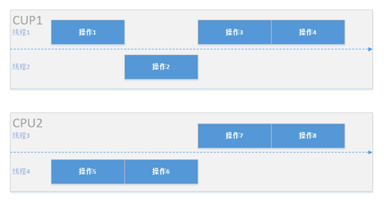

# 关于同步、异步、并行、并发等

今天就来理一理他们之间的区别与联系，涉及同步与异步、并发与并行、阻塞与非阻塞，以及他们之间的一些联系。

## 同步与异步

同步:多个任务情况下，一个任务A执行结束，才可以执行另一个任务B。（一般只存在一个线程）

异步:多个任务情况下，一个任务A正在执行，同时可以执行另一个任务B。任务B不用等待任务A结束才执行。（多线程是实现异步之一）

异步是让调用方法的主线程不需要同步等待另一线程的完成，从而可以让主线程干其它的事情。当一个异步过程调用发出后，调用者不会立刻得到结果。而是在*调用*发出后，**被调用者通过状态、通知来通知调用者，或通过回调函数处理这个调用。**

异步和同步是**从任务被执行的顺序上来区分的**，从这个基本概念出发，异步并不见得比同步性能高，也就是说异步模型不见得会比同步模型有优势。

异步通常给人一个错觉，就是他比同步快。这里其实是有一个误区，因为一个任务实际被处理的时间并没有太大变化，**只有在带阻塞的任务中，异步才可能比同步快**，因为异步快在将同步模式下带阻塞任务执行过程中cpu的等待时间利用起来处理其他任务，借此提升了多任务系统的整体并发能力。

这里说明一下，在 JavaScript 中都知道 ajax 是异步的，但是 js 的执行是单线程的，实现原理是浏览器开辟一个常驻线程来监听事件的触发，还有另一个常驻线程负责 js 的执行（有的浏览器所有标签页都是一个 js 线程来处理，当一个 fun 卡的时候其他标签页的 js 也会停止运行）。

所以单线程实现异步是有点困难的。

## 并发与并行

~~并发和并行其实是异步线程实现的两种形式~~

并行和并发是站在两个不同角度上理解产生的概念。

### 并发

并发是一个伪异步。在单核 CUP 中同一时刻只能有一条线程运行，但是又想执行多个**任务**。这个时候，只能不停的切换任务，由于CUP处理速度快，你看起来好像是同时执行，其实不是的，同一时间只会执行单个任务。

在操作系统中，并发是指**一个时间段**中有**几个程序（任务）**都处于已启动运行到运行完毕之间，且这几个程序都是在同一个处理机上运行。其中两种并发关系分别是同步和互斥

互斥：进程间相互排斥的使用**临界资源**的现象，就叫互斥，因为一个简单的语句 cpu 会拆分成多个步骤（比如：取指），所以处理多个任务时需要处理相同的资源必然会有冲突。

同步：进程之间的关系不是相互排斥临界资源的关系，而是相互依赖的关系。进一步的说明：就是前一个进程的输出作为后一个进程的输入，类似管道，当第一个进程没有输出时第二个进程必须等待。

具有同步关系的一组并发进程相互发送的信息称为消息或事件。

**其中并发又有伪并发和真并发，伪并发是指单核处理器的并发，真并发是指多核处理器的并发。**

### 并行

**并行**其实是真正的异步，多核CUP可以同时开启多条线程供多个任务同时执行，互不干扰。

在单处理器中多道程序设计系统中，进程被交替执行，表现出一种并发的外部特征，在逻辑层面上的同时工作。

在多处理器系统中，进程不仅可以交替执行，而且可以重叠执行。在多处理器上的程序才可实现并行处理。

从而可知，**并行是针对多处理器而言的**。并行是同时发生的多个并发事件，具有并发的含义，但并发不一定并行，也亦是说并发事件之间不一定要同一时刻发生。

也就是说：**并行一定是并发，并发却不一定是并行。**

### 其他

那么串行是什么呢，它是同步线程的实现方式，就是任务A执行结束才能开始执行B，单个线程只能执行一个任务，就如单行道只能行驶一辆车。

### 对比

- 并发和并行的区别就是一个处理器同时处理多个任务和多个处理器或者是多核的处理器同时处理多个不同的任务。**前者是逻辑上的同时发生（simultaneous），而后者是物理上的同时发生．**
- 并发性(concurrency)，又称共行性，是指能处理多个同时性活动的能力，**并发事件之间不一定要同一时刻发生。**
- 并行(parallelism)是指同时发生的两个并发事件，具有并发的含义，而并发则不一定并行。

**并发的关键是你有处理多个任务的能力，不一定要同时。**

**并行的关键是你有同时处理多个任务的能力。**

有张图我认为可以帮助理解：

图上反映了一个包含 8 个操作的任务在一个有两核心的 CPU 中创建四个线程运行的情况。

假设每个核心有两个线程，那么**每个CPU中两个线程会交替并发（交替执行），两个CPU之间的操作会并行运算（同时执行）**。

单就一个CPU而言两个线程可以解决线程阻塞造成的不流畅问题，但其本身运行效率并没有提高，多CPU的并行运算才真正解决了运行效率问题，这也正是并发和并行的区别。

## 阻塞与非阻塞

阻塞：阻塞调用是指调用结果返回之前，当前线程会被挂起（使cpu进入等待状态）。函数只有在得到结果之后才会返回。

非阻塞：非阻塞和阻塞的概念相对应，指在不能立刻得到结果之前，该函数不会阻塞当前线程，而会立刻返回。

阻塞和非阻塞关注的是**程序在等待调用结果（消息，返回值）时的状态**

### 拓展

同步IO和异步IO的区别就在于：数据拷贝的时候进程是否阻塞。

阻塞IO和非阻塞IO的区别就在于：应用程序的调用是否立即返回。

他们之间是可以进行组合的，详情 http://www.cnblogs.com/tracylining/p/3506673.html

## 多线程

多线程是程序设计的**逻辑层概念**，它是**进程中**并发运行的一段代码。多线程可以实现线程间的切换执行。

并发和并行都可以是很多个线程，就看这些线程能不能同时被（多个）cpu执行，如果可以就说明是并行，而并发是多个线程被（一个）cpu 轮流切换着执行。

异步和多线程并不是一个同等关系，**异步是最终目的**，**多线程只是我们实现异步的一种手段**。

异步是当一个调用请求发送给被调用者，而调用者不用等待其结果的返回而可以做其它的事情。实现异步可以采用多线程技术或则交给另外的进程来处理。

特别的一点是, "多线程/多进程"并不代表一定不会"阻塞"(这个可以看一下apache下和php-fpm的线程安全/非线程安全模式), 而实现"非阻塞"也并不一定需要"多线程/多进程"(比如node.js就是单进程/线程且异步非阻塞).

## Java中相关的IO

在理解了上面的名词后，就可以理解 Java 中高性能中经常提到的 NIO 、 BIO 、AIO 了。

就是上面那些词的组合。

### BIO（Blocking I/O）

同步阻塞 IO 模式，同步并阻塞，**服务器实现模式为一个连接一个线程**，即客户端有连接请求时服务器端就需要启动一个线程进行处理，如果这个连接不做任何事情会造成不必要的线程开销，当然可以通过线程池机制改善。 

### NIO（New I/O）

- **同步非阻塞IO（主要）** 

  同步非阻塞，**服务器实现模式为一个请求一个线程**，即客户端发送的连接请求都会注册到多路复用器上，多路复用器轮询到连接有 I/O 请求时才启动一个线程进行处理。

  NIO本身是基于事件驱动的思想来实现的，其目的就是解决BIO的大并发问题。

  **用户进程也需要时不时的询问 IO 操作是否就绪，这就要求用户进程不停的去询问。** 

- ~~异步阻塞IO~~

  此种方式下是指应用发起一个 IO 操作以后，不等待内核 IO 操作的完成，等内核完成 IO 操作以后会通知应用程序，这其实就是同步和异步最关键的区别，同步必须等待或者主动的去询问 IO 是否完成。

  那么为什么说是阻塞的呢？因为此时是通过 select 系统调用来完成的，而 select 函数本身的实现方式是阻塞的，而采用 select 函数有个好处就是它可以同时监听多个文件句柄（如果从 UNP 的角度看，select 属于同步操作。因为 select 之后，进程还需要读写数据），从而提高系统的并发性！

### AIO（ Asynchronous I/O）

异步非阻塞 IO 模式，又叫做 NIO.2 ，服务器实现模式为**一个有效请求一个线程**。

在此种模式下，用户进程只需要发起一个 IO 操作然后立即返回，等 IO 操作真正的完成以后，应用程序会得到 IO 操作完成的通知，此时用户进程只需要对数据进行处理就好了，不需要进行实际的 IO 读写操作，因为真正的 IO 读取或者写入操作已经由内核完成了。

进程中的IO调用步骤大致可以分为以下四步： 

1. 进程向操作系统请求数据 ;
2. 操作系统把外部数据加载到内核的缓冲区中; 
3. 操作系统把内核的缓冲区拷贝到进程的缓冲区 ;
4. 进程获得数据完成自己的功能 ;

当操作系统在把外部数据放到进程缓冲区的这段时间（即上述的第二，三步），如果应用进程是挂起等待的，那么就是同步IO，反之，就是异步 IO，也就是 AIO 。

### 适用场景

BIO、NIO、AIO 适用场景分析: 

BIO 方式适用于**连接数目比较小且固定的架构**，这种方式对服务器资源要求比较高，并发局限于应用中，JDK1.4 以前的唯一选择，但程序直观简单易理解。 

NIO 方式适用于**连接数目多且连接比较短（轻操作）的架构**，比如聊天服务器，并发局限于应用中，编程比较复杂，JDK1.4 开始支持。 

AIO 方式使用于**连接数目多且连接比较长（重操作）的架构**，比如相册服务器，充分调用 OS 参与并发操作，编程比较复杂，JDK7 开始支持

另外，I/O属于底层操作，需要操作系统支持，并发也需要操作系统的支持，所以性能方面不同操作系统差异会比较明显。

### 栗子

如果你想吃一份宫保鸡丁盖饭： 

**同步阻塞：**你到饭馆点餐，然后在那等着，还要一边喊：好了没啊！ 

**同步非阻塞：**在饭馆点完餐，就去遛狗了。不过溜一会儿，就回饭馆喊一声：好了没啊！ 

**异步阻塞：**遛狗的时候，接到饭馆电话，说饭做好了，让您亲自去拿。 

**异步非阻塞：**饭馆打电话说，我们知道您的位置，一会给你送过来，安心遛狗就可以了。 

---

一个 IO 操作其实分成了两个步骤：**发起 IO 请求和实际的 IO 操作。**

**同步 IO 和异步 IO 的区别**就在于实际的 IO 操作（后者）是否阻塞，如果实际的 IO 读写阻塞请求进程，那么就是同步 IO，反之则为异步。 

**阻塞 IO 和非阻塞 IO 的区别**在于发起 IO 请求（前者），发起 IO 请求是否会被阻塞，如果阻塞直到完成那么就是传统的阻塞 IO，如果不阻塞，那么就是非阻塞 IO。 

**同步和异步**是针对应用程序和内核的交互而言的，同步指的是用户进程触发 IO 操作并等待或者轮询的去查看 IO 操作是否就绪，而异步是指用户进程触发 IO 操作以后便开始做自己的事情，而当 IO 操作已经完成的时候会得到 IO 完成的通知。

而**阻塞和非阻塞**是针对于进程在访问数据的时候，根据 IO 操作的就绪状态来采取的不同方式，说白了是一种读取或者写入操作函数的实现方式，阻塞方式下读取或者写入函数将一直等待，而非阻塞方式下，读取或者写入函数会立即返回一个状态值。 

所以，IO 操作可以分为 3 类：同步阻塞（即早期的 IO 操作）、同步非阻塞（NIO）、异步（AIO）。 

- 同步阻塞： 

  在此种方式下，用户进程在发起一个 IO 操作以后，必须等待 IO 操作的完成，只有当真正完成了 IO 操作以后，用户进程才能运行。JAVA 传统的 IO 模型属于此种方式。 

- 同步非阻塞： 

  在此种方式下，用户进程发起一个 IO 操作以后边可返回做其它事情，但是用户进程需要时不时的询问 IO 操作是否就绪，这就要求用户进程不停的去询问，从而引入不必要的 CPU 资源浪费。其中目前 JAVA 的 NIO 就属于同步非阻塞 IO。 

- 异步： 

  此种方式下是指应用发起一个 IO 操作以后，不等待内核 IO 操作的完成，等内核完成 IO 操作以后会通知应用程序。

## 参考

http://qindongliang.iteye.com/blog/2018539

https://juejin.im/entry/598da7d16fb9a03c42431ed3